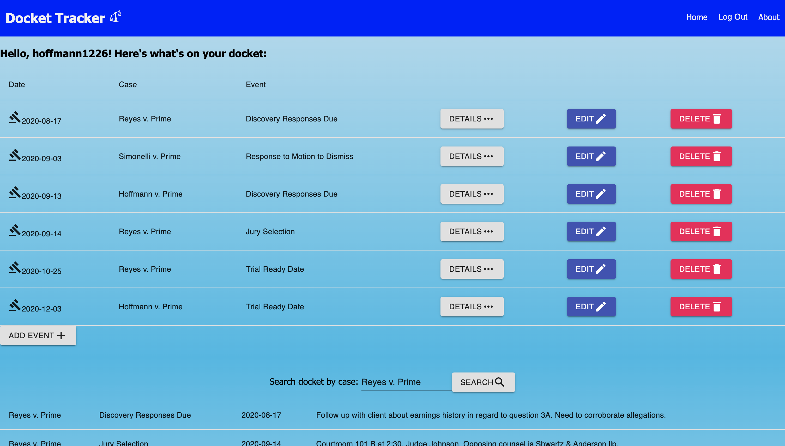

# Docket Tracker

## Description

_Duration: 2 week sprint_

This easy-to-use application helps attorneys organize their busy schedules.  With a click of a button, an attorney can add, edit, and delete cases from their docket.  An attorney can also view further case details and search their docket by case name.

## Screenshot

## Setup

1. Run the query from the database.sql file to create a new database and table.
2. Use the "npm install" command to install dependencies.
3. Use the "npm run server" command to start the server. 
4. Use the "npm run client" command to start the react development build. 
5. Access the webpage via the url "localhost:3000"

## Usage

1. Register as a new user and log in to the application.
2. At the home screen, view your docket.
3. For any specific item, click 'Details' to view further details, 'Edit' to edit information, and 'Delete' to delete the item from the table.
4. Click 'add' button to enter information in for a new item on the docket.
5. Search the docket by case name at the bottom of the page using the search bar.

## Built With

JavaScript, React, Node.js, Express, PostgreSQL, Redux, Sagas, Material UI.

## Acknowledgement
Thanks to [Prime Digital Academy](www.primeacademy.io) who equipped and helped me to make this application a reality.